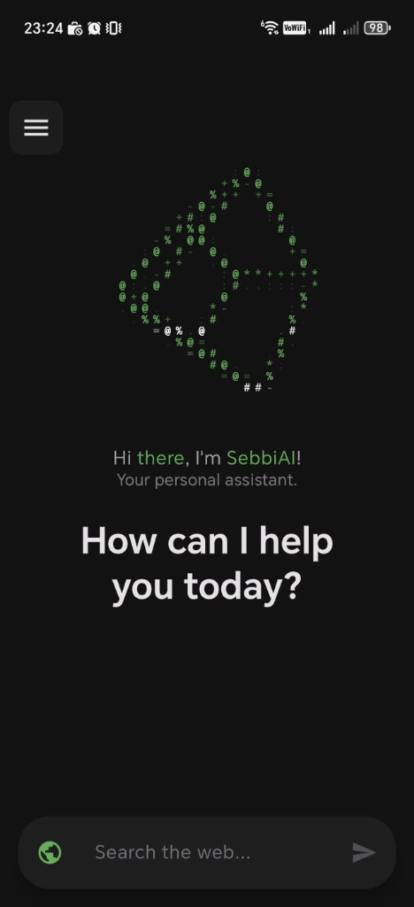
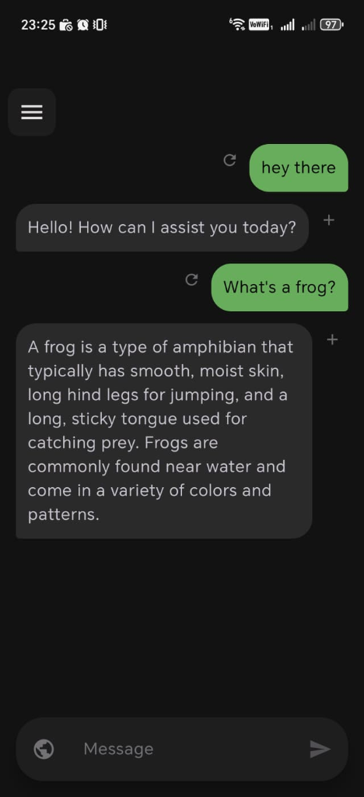
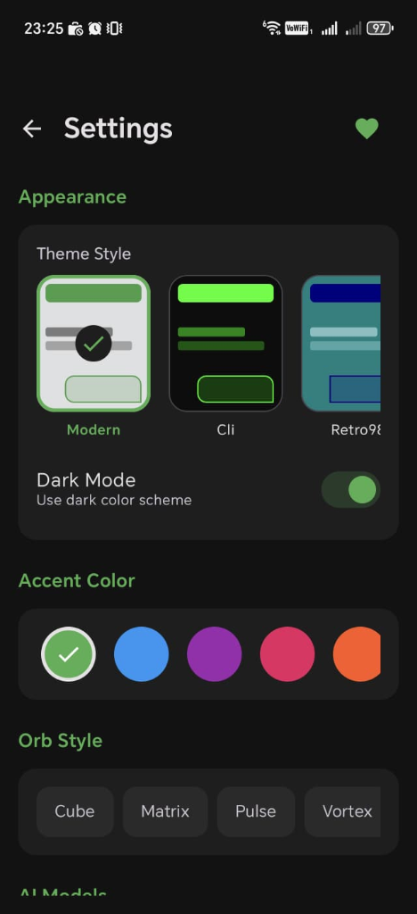
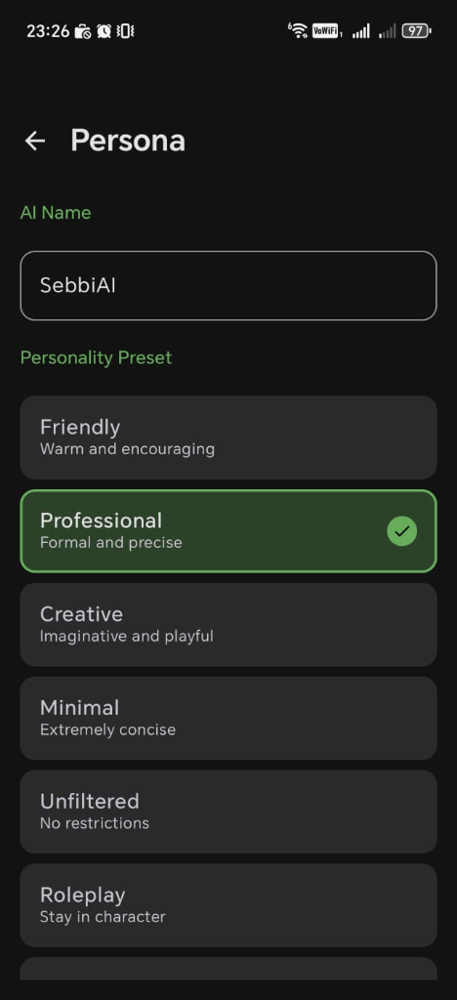
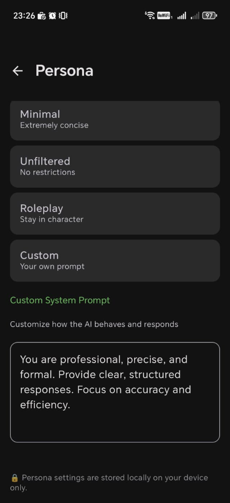
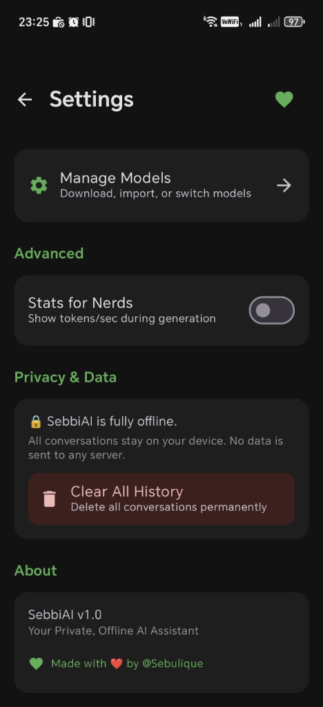
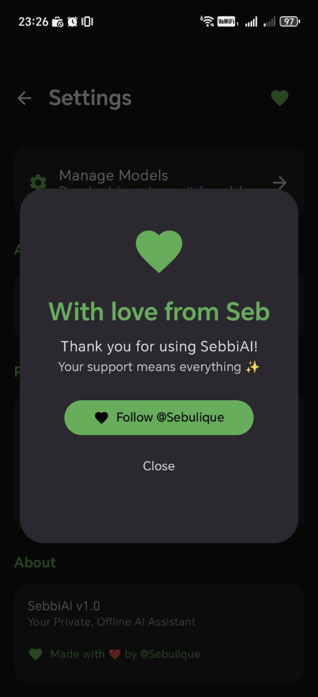

# SebbiAI 🤖✨

**Your Private, Offline AI Assistant for Android**

SebbiAI is a fully offline, privacy-focused AI chatbot that runs entirely on your device. No internet required, no data leaves your phone. Just pure, local AI power.

  
  
  

---

## ✨ Features

### 🔒 100% Offline & Private
- All AI processing happens on-device using llama.cpp
- No data is ever sent to any server
- Your conversations stay completely private

### 💬 Smart Chat
- Natural conversational AI powered by local LLMs
- Markdown rendering (bold, italic, code, headers, lists)
- Web search integration for up-to-date information
- Regenerate & copy message actions
- Conversation history with persistent storage

### 🎨 Beautiful Theming
- **10 Stunning Themes**: Modern, CLI, Retro98, Scroll, Cyberpunk, Sunset, Deep Ocean, Glacier, Forest, Midnight
- **23+ Accent Colors** with custom color picker
- Dark mode toggle
- Smooth animations throughout

### 🌀 18 Unique ASCII Orb Animations
- Cube, Matrix, Pulse, Vortex, Face, Geometry
- SebbiAI, DNA, Galaxy, Plasma, Tesseract, Wave
- Black Hole, Saturn, Atom, Heart, YinYang, Skull, Infinity, Shiba

### 🧠 AI Model Management
- Download GGUF models directly in-app
- Import your own local models
- Switch between models seamlessly
- Optimized for mobile with llama.cpp

### 🎭 Custom Personas
- Create custom AI personalities
- Set custom names & system prompts
- Built-in presets: Friendly, Professional, Creative, Minimal, Unfiltered, Roleplay

  
  

### 📊 Stats for Nerds
- Real-time tokens/second display
- Performance monitoring during generation

  
  

---

## 📱 Screenshots

| Home | Chat | Settings |
|:---:|:---:|:---:|
|  |  |  |

---

## 🚀 Getting Started

1. Clone this repository
2. Open in Android Studio
3. Build and run on your device
4. Download a GGUF model or import your own
5. Start chatting!

### Requirements
- Android 7.0+ (API 24+)
- 4GB+ RAM recommended
- Storage space for AI models (1-8GB depending on model)

---

## 🛠️ Tech Stack

- **Kotlin** - Modern Android development
- **Jetpack Compose** - Declarative UI
- **llama.cpp** - Local LLM inference
- **Room Database** - Conversation persistence
- **Material 3** - Beautiful design system
- **Coroutines & Flow** - Async operations

---

## 🤝 Contributing

Contributions are welcome! Feel free to open issues or submit pull requests.

---

## 📄 License

This project is open source. See LICENSE for details.

---

  <b>Made with ❤️ by Seb</b> 
  <a href="https://instagram.com/Sebulique">@Sebulique</a>

  Thank you for checking out SebbiAI! 
  Your support means everything ✨

